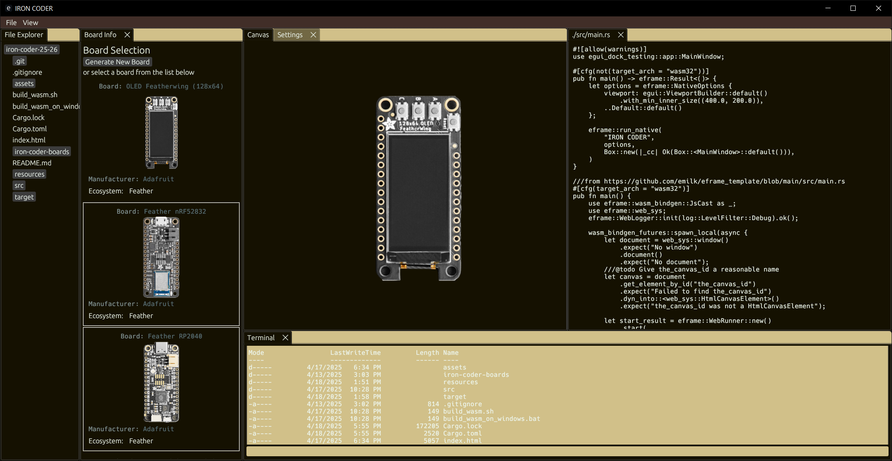

# iron-coder-25-26
This project serves as a testing environment for future Iron Coder features. Although not fully functional, it demonstrates multiple individually functional Iron Coder features in a refactored interface.



## How to Build and Run

### To build and run the application:

Requires rust version >= 1.85.0

```bash
cargo install cargo-generate
cargo run
```

### For flashing toolchains:

AVR (Arduino boards)
- `rustup component add rust-src --toolchain nightly-x86_64-pc-windows-msvc`
- avr-gcc
- avr-libc
- avrdude
- `cargo +stable install ravedude`

ESP32
- `cargo install espflash`


## Prototype Application Goals:
Add existing features from Iron Coder to the new interface:
- WebAssembly compilation (Jonathan L)
	- Basic demonstration of the capability to compile for WebAssembly.
- Board Information (Jonathan L)
	- Board Information window.
- Canvas implementation (Jonathan B)
	- Canvas window with various optimizations.
- FileTab implementation (Jonathan B)
	- File editing tab.
- Terminal window implementation (Evan P)
	- Terminal window proof of concept.
- File Explorer window implementation (Evan P)
	- File Explorer window shows files and directories.
	
Add novel features:
- Colorschemes (Jonathan L)
	- Set Colorschemes for UI and text.
- Centralized SharedState struct (Jonathan B)
	- Refactor interservice communication.
- Keyboard shortcuts (Evan P)
	- Allow users to set custom keyboard shortcuts.

## Known Bugs
- Rapidly moving selected objects will scroll the Canvas due to mouse location inaccuracies.